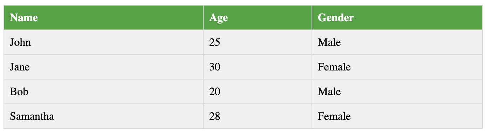

# Table Debug 

## Goal
Create a web page that displays a table with the following information:

Currently the table is not displaying correctly. There are several errors in the HTML code that need to be fixed.

## Directions
- refactor and debug the html file to render the table as above

- Refer to [MDN Docs](https://developer.mozilla.org/en-US/docs/Learn/HTML/Tables/Basics) to help complete this assignment.

- *Extra Credit:* Add css styles to your table to match the screenshot above.