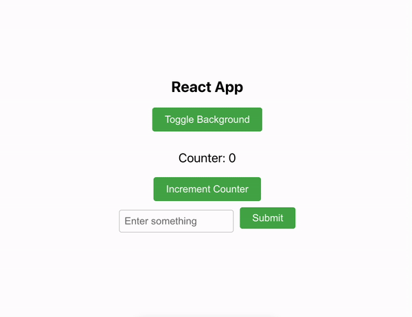

# Broken State

This project was bootstrapped with [Create React App](https://github.com/facebook/create-react-app).

## Context

In this guide, we will walk you through the process of debugging a simple React app. The app has three main functionalities: toggling the background color at the press of a button, incrementing a counter when another button is pressed, and submitting a form that displays an error message if the input is blank. Upon successful completion of the form, a success modal will appear.

Before we begin, make sure you have Node.js and npm (Node Package Manager) installed on your machine. If you don't have them installed, please follow the official documentation for your operating system to install them.

## Installation
1. Open your command line or terminal.
2. Navigate to the root directory of the broken-state project.
3. Run the following command to install the required dependencies:
`npm install `

This command will download and install all the necessary packages and dependencies defined in the `package.json` file.

## Running the App
Once the installation is complete, you can start the app using the following command:
`npm start`

This command will start the development server and automatically open the app in your default browser. If the app doesn't open automatically, you can access it by navigating to `http://localhost:3000` in your browser.

## Debugging Instructions
To understand the expected behavior of the app and identify any issues, follow the steps below:

1. Open the app in your browser.
2. Take a moment to familiarize yourself with the app's interface.
3. The app should have a button that toggles the background color when clicked. Try clicking the button and observe if the background color changes accordingly.
4. Look for a button that is supposed to increment a counter when clicked. Click the button and check if the counter value increases as expected. 
5. Locate the form input field. The app should display an error message if you try to submit the form without entering any value. Submit the form without entering anything and verify if the error message appears correctly.
6. Enter a value in the input field and submit the form. The app should clear the input field and display a success modal upon successful completion of the form. 
7. Click the x to close the success modal.

While going through these steps, pay attention to any inconsistencies or unexpected behavior that deviates from the expected functionality. These observations will help you identify and address the issues in the app.

Additionally, refer to the provided GIF below to see how the app is expected to function:

By following these steps and referring to the provided GIF, you should be able to assess the app's behavior and determine if there are any bugs or issues that need to be resolved.

Happy debugging!

